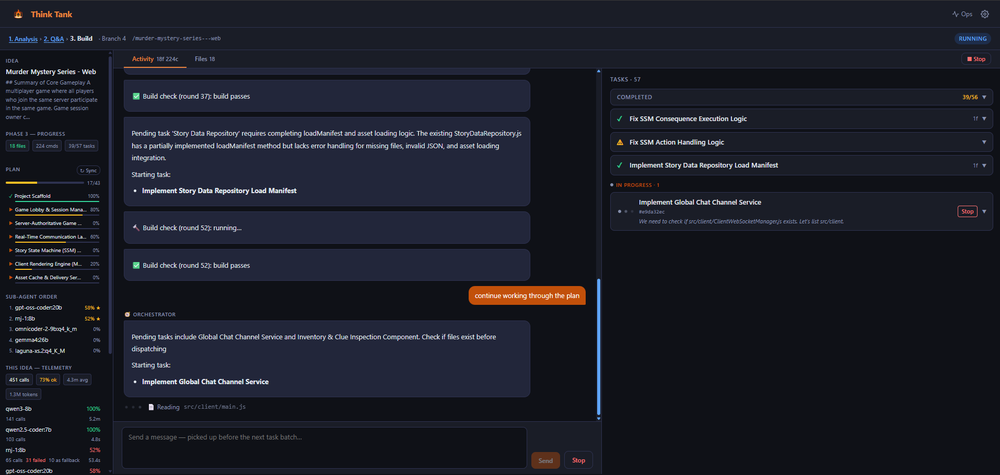
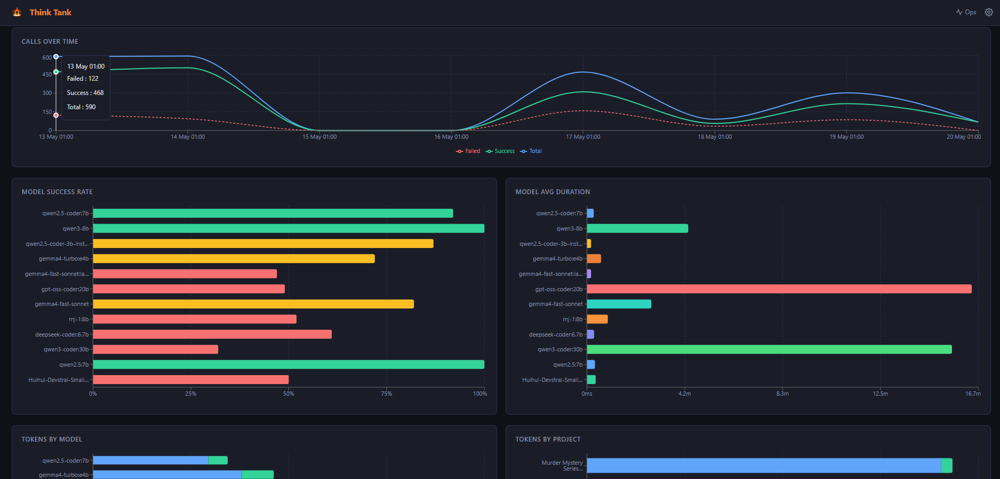
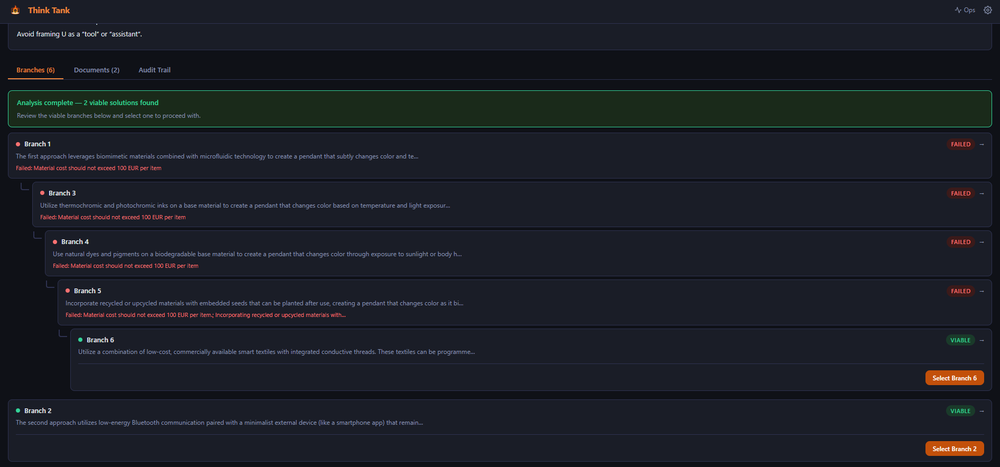

# Think Tank

A local AI system that takes a raw idea through structured analysis, interactive Q&A, and autonomous multi-agent code generation — running entirely on your own hardware with no API costs or context limits.



---

## What makes this interesting

**Multi-agent code generation with local models.** Phase 3 runs an orchestrator LLM that reads the full project spec, plans implementation tasks, and dispatches them to sub-agent workers. Each sub-agent writes files, runs shell commands, and reports back. The orchestrator then plans the next batch. All on-device.

**Hybrid inference: Ollama + OpenVINO.** The orchestrator can run on an Intel NPU or iGPU via OpenVINO GenAI while sub-agents use GPU models via Ollama. You can mix backends per stage in a single config file.

**Auto-fallback chains.** Every stage has a priority-ordered list of fallback models. If the primary fails (OOM, timeout, bad output), the next model is tried automatically. The pipeline keeps running.

**Config-only model routing.** All stage → model → backend assignments live in `models.yaml`. Swap any model without touching application code.

**Live model telemetry.** An Ops dashboard tracks inference call counts, success rates, average duration, p95 latency, and fallback rates per model across all pipeline runs.



---

## How It Works

### Phase 1 — Analysis & Selection

Submit an idea with a description, requirements, and constraints. Think Tank spawns multiple parallel solution branches and runs each through an 8-stage pipeline:

| Stage | What it does |
|-------|-------------|
| 0 — Intake | Normalises and structures the raw idea |
| 1 — Feasibility Scan | Assesses technical and practical viability |
| 2 — Solution Design | Designs a concrete solution architecture |
| 3 — Solution Analysis | Deep-dives risks, tradeoffs, and unknowns |
| 4 — Decomposition | Breaks the solution into components and tasks |
| 5 — Component Validation | Validates each component independently |
| 6 — Deep Review | Final cross-cutting review of the full solution |
| 7 — Documentation | Generates architecture docs, specs, roadmap, and more |

Branches that fail are analysed for root cause and new alternative branches are spawned. The pipeline converges when at least one branch reaches VIABLE status. You then review all viable solutions and select one to proceed with.



### Phase 2 — Q&A & Resolution

An interactive chat session that surfaces every open question and assumption from the Phase 1 documents. You answer unknowns, inject constraints, and make architectural decisions. When all questions are resolved, you mark the session as READY.

### Phase 3 — Multi-Agent Implementation

The orchestrator reads the full Phase 1 document package and Phase 2 resolution summary, then drives a loop:

1. **Plan** — the orchestrator LLM produces a batch of implementation tasks, each assigned to a model tier (fast / standard / large) based on complexity
2. **Dispatch** — sub-agent workers execute tasks in parallel: write files, run install/build commands, verify results
3. **Review** — the orchestrator inspects written files and decides the next batch, or declares done
4. **Iterate** — chat with the agent after completion to request changes, add features, or fix issues

Sub-agents can use different models per task — a config file tweak, not a code change.

---

## Requirements

- Python 3.11+
- Node.js 18+
- [Ollama](https://ollama.com) installed and running
- A GPU with enough VRAM for the models you want to run (tested on RTX 4070 SUPER 12 GB)
- **Optional:** Intel Core Ultra CPU for OpenVINO NPU/GPU stages (tested on Core Ultra 7 265k)

---

## Quick Start

### 1. Pull models

Think Tank routes different stages to different models. A minimal working set:

```bash
# Phase 1 — analysis and reasoning
ollama pull phi4:14b

# Phase 3 — code generation (pick based on your VRAM)
ollama pull qwen2.5-coder:14b   # standard tier
ollama pull qwen3.5:9b          # fast tier (lightweight tasks)
```

See [Model Configuration](#model-configuration) for the full routing setup and alternatives.

### 2. Install backend

```bash
cd backend
python -m venv .venv
.venv\Scripts\activate      # Windows
# source .venv/bin/activate  # Linux/macOS
pip install -r requirements.txt
```

### 3. Configure environment

```bash
cp backend/.env.example backend/.env
# Ollama URL defaults to http://localhost:11434 — edit if needed
```

### 4. Install frontend

```bash
cd frontend
npm install
```

### 5. Start

```bash
# From repo root — starts both API and UI
npm run dev
```

Or separately:

```bash
npm run dev:api   # FastAPI on http://localhost:8000
npm run dev:ui    # Vite on http://localhost:5173
```

Open **http://localhost:5173** and submit your first idea.

---

## Model Configuration

All routing lives in `backend/models.yaml`. Each pipeline stage maps to a model, backend, temperature, context size, and fallback chain. No code changes needed to swap models.

```yaml
stages:
  # Phase 1 — reasoning model for analysis stages
  feasibility_scan:
    model: "phi4:14b"
    backend: "ollama"
    temperature: 0.2

  # Phase 3 — orchestrator (can use OpenVINO for NPU/iGPU)
  phase3_orchestrator:
    model: "qwen3-8b"
    backend: "openvino"
    device: "AUTO:CPU"

  # Phase 3 — sub-agents: orchestrator picks tier per task
  phase3_sub_agent:
    selectable_models:
      - name: "fast"
        model: "qwen3.5:9B"
        description: "Config files, simple edits, boilerplate"
      - name: "standard"
        model: "qwen2.5-coder:14b"
        description: "Multi-file modules, straightforward logic"
      - name: "large"
        model: "qwen3-coder:30b"
        description: "Complex algorithms, intricate cross-file wiring"
    fallback_models:
      - "mrthp/omnicoder2"
      - "gemma4:latest"
      - "qwen2.5-coder:14b"
    backend: "ollama"
```

Supported backends: `ollama`, `openvino` (Intel NPU/GPU via OpenVINO GenAI), `llamacpp` (experimental).

### OpenVINO setup (optional)

If you have an Intel Core Ultra CPU, you can run smaller orchestration models on the NPU/iGPU, leaving the GPU fully available for sub-agents.

```bash
pip install openvino-genai
# Convert and cache a model (first run downloads and converts automatically)
# Set backend: "openvino" and device: "AUTO:NPU,GPU,CPU" in models.yaml
```

---

## Project Structure

```
thinktank/
├── backend/
│   ├── app/
│   │   ├── agents/          # Phase 3: orchestrator + sub-agent loop
│   │   ├── api/             # FastAPI route handlers
│   │   ├── db/              # SQLAlchemy models + migrations
│   │   ├── events/          # In-process event bus → WebSocket push
│   │   ├── inference/       # InferenceClient, backend drivers, model registry
│   │   ├── pipeline/        # Phase 1 orchestrator, branch runner, stage implementations
│   │   ├── telemetry.py     # Per-call telemetry log (JSONL)
│   │   └── tools/           # Shell runner, web search, file tools
│   ├── models.yaml          # Stage → model routing (edit this, not code)
│   └── requirements.txt
├── frontend/
│   └── src/
│       ├── api/             # API + WebSocket client
│       ├── components/      # React components (pipeline view, phase 3 UI, ops dashboard)
│       └── types/
├── docs/                    # Screenshots
└── package.json             # Root dev scripts (npm run dev starts everything)
```

---

## Hardware Tested

| Component | Spec |
|-----------|------|
| GPU | NVIDIA RTX 4070 SUPER (12 GB VRAM) |
| NPU/iGPU | Intel Core Ultra 7 265K (Arc iGPU + NPU via OpenVINO) |
| RAM | 64 GB |
| OS | Windows 11 |

Smaller GPUs will work with smaller models — adjust `models.yaml` accordingly. The fallback chain means the pipeline degrades gracefully if a large model OOMs.

---

## License

MIT
